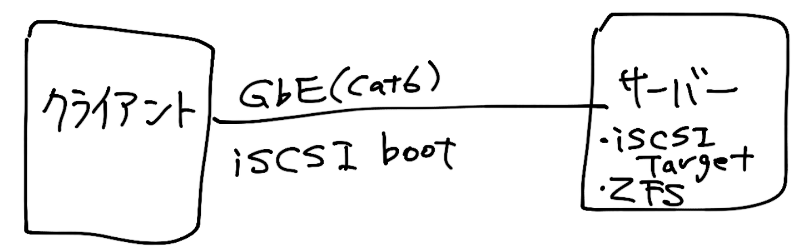

# ストレージと私

428(ｮｯｬ)

---

## ある日のこと

+ Windowsクソ重くなってきた
+ ディスクが足りなくなってきた

---

+ あー、再インストールめんどくせー
+ あー、バックアップめんどくせー
+ あー、設定のやりなおしめんどくせー

---

# (ﾟДﾟ)

---

## もう再インストールはこりごり

+ <span style="color:yellow">自動スナップショット</span>がとれる、
+ <span style="color:yellow">大容量</span>ストレージサーバーを構築し
+ Windowsを<span style="color:yellow">ディスクレスブート</span>したらいいんじゃね？

---

## ポイント

+ 無限にディスクを増やせるようにしたい

---

## [質問] 無限って<br>どのくらい増やしたいの？

+ 何<span style="color:yellow">テラ</span>バイト？

---

# (ﾟДﾟ)

---

## [答え]

# <span style="color:yellow">ゼタ</span>バイト級

---

## 1ゼタバイト

2^70 = 1,024^7 = 1,180,591,620,717,411,303,424バイト

+ テラ
+ ペタ
+ イクサ
+ ゼタ ←これ

---

そんな巨大ディスク空間を扱える<br>ファイルシステムは存在するのか

---

# ZFS

### ゼタバイト・ファイルシステム

---

# Zは最強の証

---

うんざりするほど増やせる

---

## ディスクレスブート

+ iSCSI boot

---

# ZFS + iSCSI = <br><span style="color:yellow">最強</span>になれる

---

## つまりこう



+ iSCSI boot
    + ディスクレスブート
+ ZFS
    + いけてるファイルシステム

---

## どうやってiSCSIブートさせるか

---

## iSCSI inititatorの選択


---

# iSCSI HBA対応のNIC

---

## でもお高いんでしょう？

既製品のiSCSI HBAに対応したNICは20万円クラス

---

## 廉価なNICをHBA化する

---

# インテルNICをHBA化

---

安い！1万円でおつりがくる

---

## NICのiSCSI HBA化

### ファームウェア書き換え

```
Starting...

Microsoft(R) Windows Millennium
   (C)Copyright Microsoft Corp 1981-1999.

C:\>BootUtil

Intel(R) Ethernet Flash Firmware Utility
BootUtil version 1.2.72.0
Copyright (C) 2003-2011 Intel Corporation

Type BootUtil -? for help

Port Network Address Series  WOL Flash Firmware        Version
==== =============== ======= === ===================== =======
  1  001E8C051FB6    Gigabit YES LOM,PXE
  2  001B21B77891    Gigabit YES PXE                   1.3.21
```

---

## NICのiSCSI HBA化

### iSCSI boot configuration


---

## iSCSI Initiator --as client

+ OS
    + Windows XP
    + Windows Vista
    + Windows 7
+ Mem
    + 16GB
+ NIC
    + Intel Gigabit CT Desktop Adapter EXPI9301CT
+ Storage
    + <span style="color:yellow;">no disk</span>

---

## iSCSI Target --as server

+ OS
    + FreeBSD-7.0 PRE-RELEASE
+ Mem
    + 16GB
+ Storage
    + SATA 1TB x 10
    + FileSystem
        + ZFS ( RAIDZ1 + Spare Disk )

---

## ZFSはメモリーを食う

+ kernelメモリーを潤沢に割り当てなければならない

---

## カーネルアドレス空間の壁

+ kernelメモリーをがっつり割り当てたら、kernel panicを起こした！

```/boot/loader.conf
vm.kmem_size="8196M"
```

---

## BSD kernelの改造

+ kmem周りのコードを修正し、`make world`

---

## サーバー起動方法

+ USB Flash Memoryから起動
+ load device module (ZFS enable)
+ ZFS root (mount)
+ Multi user mode

---

## 構築したサーバー


---

## Windows Vistaのベンチ

+ シーケンシャルR/W
    + 110MB/s

+ ランダムR/W
    + 80MB/s

---

## 巨大なLUN(論理ボリューム)の試験

+ <span style="color:yellow">1PB</span>のスパースファイルを作成し、iSCSI Targetにディスクイメージとして設定。
+ Windows VISTAで<span style="color:yellow">1PB</span>のディスクを認識した。
+ Windowsのクセにやるじゃないか

---

## というのが8年前までの話

---

# 近ごろの<br>ストレージ生活

---

## ポイント

新幹線の中でiSCSIしたい

---

## 省エネ指向

+ あまり電気を使わない
+ 持ち運べる

---

# ポータブル<br>iSCSIターゲット

---

## ポータブルiSCSIターゲット

+ ベアボーンPCに


<small>Intel NUC Core i7-6770HQ搭載 小型PCベアボーン M.2 SSD - BOXNUC6I7KYK</small>

+ VMware ESXi6をインストール
+ AWS Storage Gatewayインスタンスを起動

---

## ポータブルiSCSIターゲット


---

## ポータブルiSCSIターゲット

VMware ESXi6の画面


---

楽しい！！✌('ω'✌ )三✌('ω')✌三(✌'ω')✌

---

## 良いストレージライフを


---

おしまい🍣 🍺
