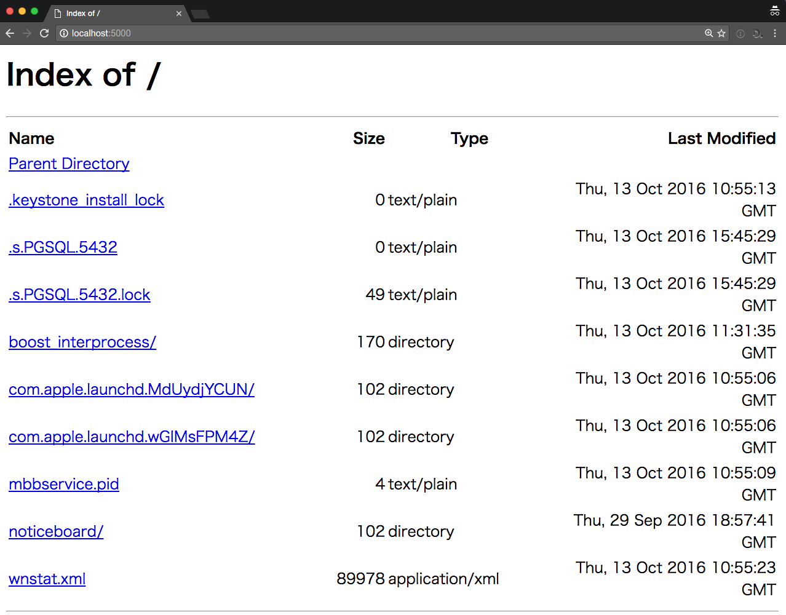
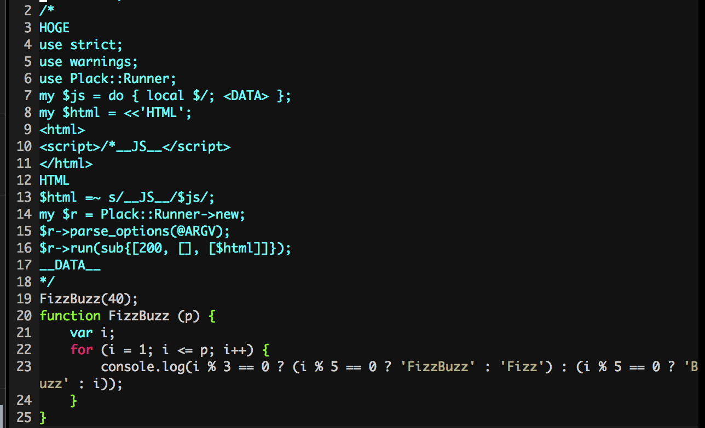
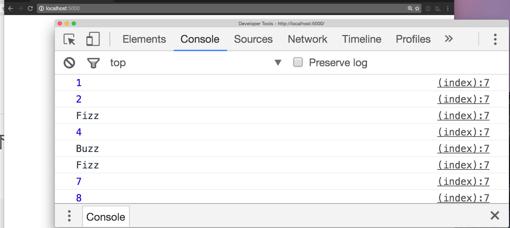

# Perlの使いみち

428(ｮｯｬ)

---

## ワンライナーのおともに🍺

くわしくは御ググリください

---

## 基本的な書き方

```
$perl -e '#code'
```

---

```
$perl -e 'print "Hello,World"'
Hello,World
```

---

## 複数行のコードを

```
$string = "Hello,World";
for(1..3) {
    print $string;
}
```

---

## 1行にしただけ

```
$ perl -le '$string = "Hello,World";for(1..3){print $string;}'
Hello,World
Hello,World
Hello,World
```

---

## AWK的に

```
% echo "a,b,c" | perl -F, -anle 'print "$F[0] = $F[2]"'
a = c
```

---

長くてもOK

---

## ちょっと素因数分解したくなっちゃったとき

```
% perl -le '$s=("x"x pop);while($s=~/^(xx+?)\1+$/){print length($1);$s=~s/$1/x/g}print length($s)' 100
2
2
5
5
```
---

## HTTPサーバーとしてのPerl

---

## 必要なもの

```
cpanm Plack
```

あとは適宜

---

## HTTP Server

```
plackup -e 'sub{[200, [], ["hello world"]]}'
```

```
% curl localhost:5000
hello world
```

---

## HTTPS Server (1/2)

```
openssl genrsa -out server.key 2048
```

```
openssl req -new -key server.key -out server.csr -subj '/C=JP/ST=Tokyo/L=Tokyo/O=Example Ltd./OU=Web/CN=example.com'
```

```
openssl x509 -in server.csr -days 3650 -req -signkey server.key > server.crt
```

---

## HTTPS Server (2/2)

```
plackup -s HTTP::Server::PSGI --ssl-key-file server.key --ssl-cert-file server.crt --ssl 1 -e 'sub{[200, [], ["hello world"]]}'
```

```
% curl -k https://localhost:5000
hello world
```

---

## スタティックなコンテンツ

```
plackup -MPlack::App::Directory -e 'Plack::App::Directory->new(root => "/tmp")'
```



---

## jsシンタックスハイライトでPerlのコードを書く。

---

## solution


<!--
```perl
1// <<HOGE;
/*
HOGE
use strict;
use warnings;
use Plack::Runner;
my $js = do { local $/; <DATA> };
my $html = &lt;&lt;'HTML';
&lt;html&gt;
&lt;script&gt;/*__JS__&lt;/script>gt;
<gt;/html>gt;
HTML
$html =~ s/__JS__/$js/;
my $r = Plack::Runner->new;
$r->parse_options(@ARGV);
$r->run(sub{[200, [Content-Type => "text/html"], [$html]]});
__DATA__
*/
FizzBuzz(40);
function FizzBuzz (p) {
    var i;
    for (i = 1; i <gt;= p; i++) {
        console.log(i % 3 == 0 ? (i % 5 == 0 ? 'FizzBuzz' : 'Fizz') : (i % 5 == 0 ? 'Buzz' : i));
    }
}
```
-->

---

### javascriptとして実行

```
% node fizzbuzz.js
1
2
Fizz
4
Buzz
Fizz
7
8
Fizz
Buzz
```

---

### perlとして実行

```
% plackup fizzbuzz.js
HTTP::Server::PSGI: Accepting connections at http://0:5000/
```



---

おしまい🍣 🍺
